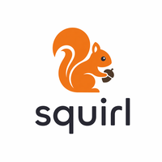

<p align="center">
  
</p>

<h1 align="center">squirl</h1>

<p align="center">
  A fast, hackable, terminal-native AI client.<br/>
  <em>Think Claude Code UX — but open, local-first, and multi-provider.</em>
</p>

<p align="center">
  
</p>

---

## Why squirl?

Most AI tools are either:
- 🔒 Locked into a single provider  
- 🧱 Heavy GUI apps  
- 🧪 Hard to experiment with  

**squirl is different:**
- ⚡ Runs in your terminal (React Ink)
- 🔌 Works with *any* OpenAI-compatible backend (Ollama, vLLM, etc.)
- 🧠 Built for *real workflows*, not just chatting
- 🛠️ Designed to be extended, hacked, and automated

If you like the feel of tools like Claude Code or Cursor, but want **control + openness**, squirl is your layer.

---

## Features

### 🧠 Core Experience
- **Streaming responses** with live tokens/sec + latency feedback
- **Interrupt anytime** (`esc`) — no more waiting on slow generations
- **Context window tracking** — know exactly what you're burning
- **Chat + input history** — persistent, local, simple

### 🔌 Multi-Provider by Design
- OpenAI, Anthropic (Claude)
- Local models via **Ollama**, **vLLM**, or any OpenAI-compatible API
- Seamless switching via model picker (`ctrl+p`)

### 🛠️ Built-in Tooling (Agent-lite)
- File read/write
- Command execution
- Directory inspection

> Enough power to be useful, without turning into an opaque “agent framework”

### 🖥️ Terminal-First UX
- Markdown rendering (code blocks, lists, etc.)
- Collapsible `<think>` blocks (`ctrl+v`) for reasoning models
- Paste collapsing for large inputs
- Familiar shell-like keybindings

---

## What makes it different?

### 1. It's not trying to hide the model

Most tools abstract everything away.

**squirl surfaces reality:**
- tokens/sec
- context usage
- streaming behavior

You *see* how the model behaves.

---

### 2. It's a harness, not a product

This is closer to:
- a **developer tool**
- a **testing harness**
- a **personal AI runtime**

Not just a chat app.

---

### 3. Local-first, but not local-only

Use:
- local models for speed/privacy
- cloud models for quality

Switch instantly.

---

## Planned Features (Roadmap)

### 🧠 Memory System
- Vector + semantic memory layer
- Auto-retrieval of relevant past context
- Long-term conversational continuity

### 🧩 Modular Tool System
- Pluggable tools (like MCP-style servers)
- Bring your own:
  - database queries
  - APIs
  - internal services

### 🔁 Multi-step Reasoning Loop
- Planner → retriever → executor → responder
- Optional orchestration (not forced)

### 📂 Workspace Awareness
- Project-level context
- File indexing + embeddings
- Codebase-aware conversations

### ⚡ Performance Modes
- Speculative decoding support
- Multi-model pipelines (draft + verify)
- Optimized for multi-GPU setups (vLLM)

### 🧪 Advanced Debugging
- Inspect prompts
- Inspect tool calls
- Replay / fork conversations

---

## Getting Started

```bash
pnpm install
pnpm dev
```

On first run, squirl walks you through:
- provider selection
- API key setup

Config lives at:
```
~/.squirl/config.json
```

---

## Keybindings

| Key | Action |
|-----|--------|
| Enter | Send message |
| Esc | Cancel streaming / clear input |
| Ctrl+C | Exit |
| Ctrl+P | Model picker |
| Ctrl+V | Toggle thinking blocks |
| Up/Down | Input history |
| Ctrl+A/E | Start/end of line |
| Ctrl+W | Delete word |
| Ctrl+U/K | Delete to start/end |

---

## Build

```bash
pnpm build
pnpm start
```

---

## Inspiration

- Claude Code (UX philosophy)
- Terminal tools like `lazydocker`, `htop`
- The idea that AI should feel like a **primitive**, not a product

---

## License

Source-available under the [Elastic License 2.0](LICENSE). You may use, copy, modify, and redistribute squirl, but you may not:

- provide it to third parties as a hosted or managed service,
- circumvent license key functionality, or
- remove or obscure any licensing, copyright, or other notices.

See `LICENSE` for the full terms.
