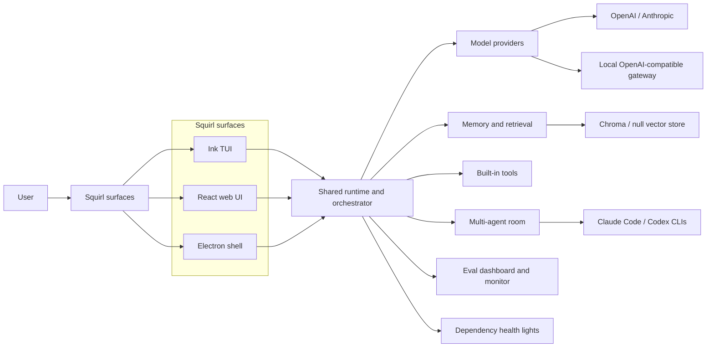

# Squirl Architecture Dashboard

This folder is an Obsidian-friendly architecture workspace. Open the repo, or this `docs/architecture` folder, as an Obsidian vault to browse the diagrams and update the implementation status as the system changes.

## Navigation

- [[overall-architecture]] - system map across the TUI, web/Electron runtime, model providers, memory, tools, evals, health, and multi-agent room.
- [[memory-and-eval]] - memory indexing, retrieval, eval layers, dashboard, and auto-monitoring.
- [[multi-agent-room]] - @mention routing, subprocess adapters, participant status, and known broadcast limitations.
- [[status-tracker]] - current completion estimates, blockers, and next steps.

## Architecture At A Glance

## Operating Rules

- Keep Mermaid diagrams close to the real code paths; avoid adding future components to the diagram until there is a concrete implementation plan or code.
- Treat percentages in [[status-tracker]] as planning estimates, not quality scores.
- When an architecture area changes, update both its diagram note and the tracker row in the same work pass.
- Prefer short notes with links to source owners over long copied explanations.
