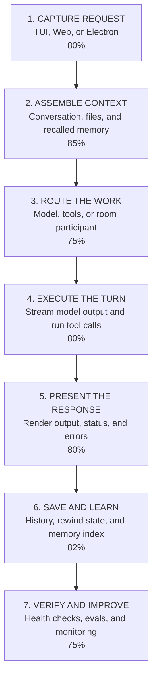

# Squirl Linear Pipeline

Read this page from top to bottom. It follows one request through Squirl from the moment it is entered until the result is saved and measured.

Percentages are planning estimates. They describe how complete each stage feels across implementation, tests, and day-to-day usability.

## The Pipeline

## Where We Are

The main chat path is usable end to end. The strongest areas are context assembly, core chat orchestration, history, and memory indexing.

The current gaps are concentrated near the end of the pipeline and in advanced routing: query-extraction evaluation, persistent web event delivery, asynchronous multi-agent behavior, and the decision around remote agent transport.

See [[status-tracker]] for the next concrete action at every stage.

## Drill Down Only When Needed

- [[status-tracker]] - progress, current truth, and next action by pipeline stage.
- [[architectural-decisions]] - accepted architecture choices, rationale, and consequences.
- [[memory-and-eval]] - detail for recalled memory, indexing, and evaluation.
- [[multi-agent-room]] - detail for participant routing and agent sessions.
- [[overall-architecture]] - code-oriented component map for implementation tracing.

## Keeping It Current

- Update a stage only when something meaningfully changes in implementation, tests, or usability.
- Update the stage percentage and its next action together.
- Keep code-level detail in the drill-down notes so this page stays readable.
