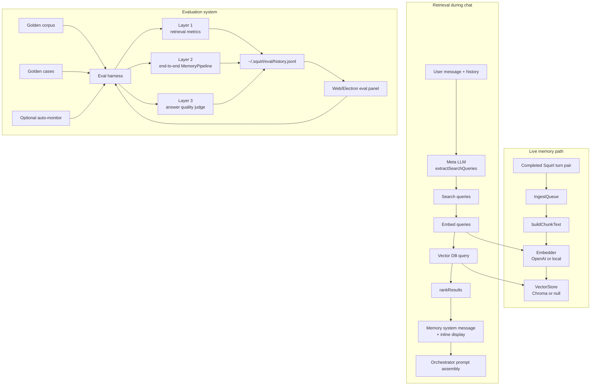

# Memory And Eval Architecture

## Completion Signals

| Slice | Status | Completion | Notes |
|---|---:|---:|---|
| Turn-pair ingestion and indexing | In place | 85% | Queue, chunking, embedders, stores, status emitter, and backfill path exist. |
| Retrieval pipeline | In place | 80% | Query extraction, embedding, vector query, ranking, prompt injection, and inline display exist. |
| Eval layers | Mostly in place | 80% | Layers 1-3 exist; Layer 0 query-extraction quality remains unbuilt. |
| Eval dashboard | In place | 75% | Web panel, history trends, run button, and Layer 3 live log exist. |
| Auto-monitor | In place | 70% | Timer exists and is config-gated; alerting and richer surfacing are still light. |

## Known Gaps

- Layer 0 eval coverage for query extraction quality is not built.
- The golden set is intentionally small; it is strong for catching regressions and weaker for proving broad improvements.
- Memory quality and runtime health are visible, but they are not yet consolidated into one architecture progress screen.

