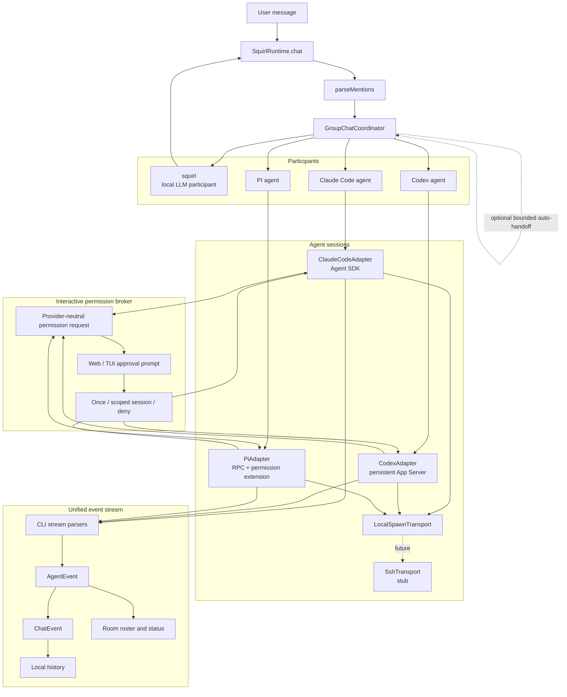

# Multi-Agent Room Architecture

## Completion Signals

| Slice | Status | Completion | Notes |
|---|---:|---:|---|
| Participant model | In place | 85% | User, local LLM, and external agents share a routing model. |
| Claude/Codex/PI adapters | In place | 90% | Claude uses the Agent SDK, Codex uses persistent App Server JSON-RPC, and PI uses RPC with a Squirl permission extension. |
| Safety defaults | In place | 90% | Approval posture is profile-configurable. Defaults are Claude accept-edits, Codex on-request/workspace-write, and PI accept-edits/coding. |
| UI room roster | In place | 75% | TUI and web surfaces expose participants and status. |
| Async broadcast | In place | 85% | Participant turns use independent FIFOs and web/Electron receives background events from `GET /api/events`. |
| SSH transport | Stub | 10% | Interface exists but remote execution is not implemented. |

## Known Gaps

- Event reconnects reconcile from authoritative application state; the event feed does not durably replay every transient token.
- Queued outbox work is runtime-local and is intentionally discarded rather than replayed after restart.
- SSH-backed agents are represented by a transport stub, not a working remote path.
- PI is an external prerequisite. Squirl neither installs PI nor stores its provider credentials.
- PI still has no native sandbox. Squirl's bundled extension gates side-effecting tools before execution; `read-only` restricts built-ins to `read`, `grep`, `find`, and `ls`.

## Permission approvals

All adapters emit the same permission request contract. The frontend shows allow-once, a provider-supported and visibly scoped session grant, and deny. Pending prompts are runtime application state so browser reconnects can restore them. Stopping, interrupting, or reconnecting an agent fails pending requests closed and clears session grants; individual grants are never written to Squirl or provider settings.

Claude permission checks use the Agent SDK `canUseTool` callback and accept only allow-rule or directory suggestions rewritten to session scope. Codex command and file approvals use App Server JSON-RPC and never apply persistent policy amendments. PI session grants are limited to a canonical file path, an exact normalized command, or a bounded exact custom-tool request.

## PI RPC integration

Squirl launches `pi --mode rpc` with its permission-gate extension. Text, tool activity, extension dialogs, session identity, interruption, and context statistics are translated into the shared agent contracts. Interactive extension requests (`select`, `confirm`, `input`, and `editor`) are bridged into the active Squirl frontend; reserved permission selects are promoted into the provider-neutral approval UI.

Protocol references: [PI CLI](https://github.com/earendil-works/pi/blob/main/packages/coding-agent/README.md) and [PI RPC mode](https://github.com/earendil-works/pi/blob/main/packages/coding-agent/docs/rpc.md).
