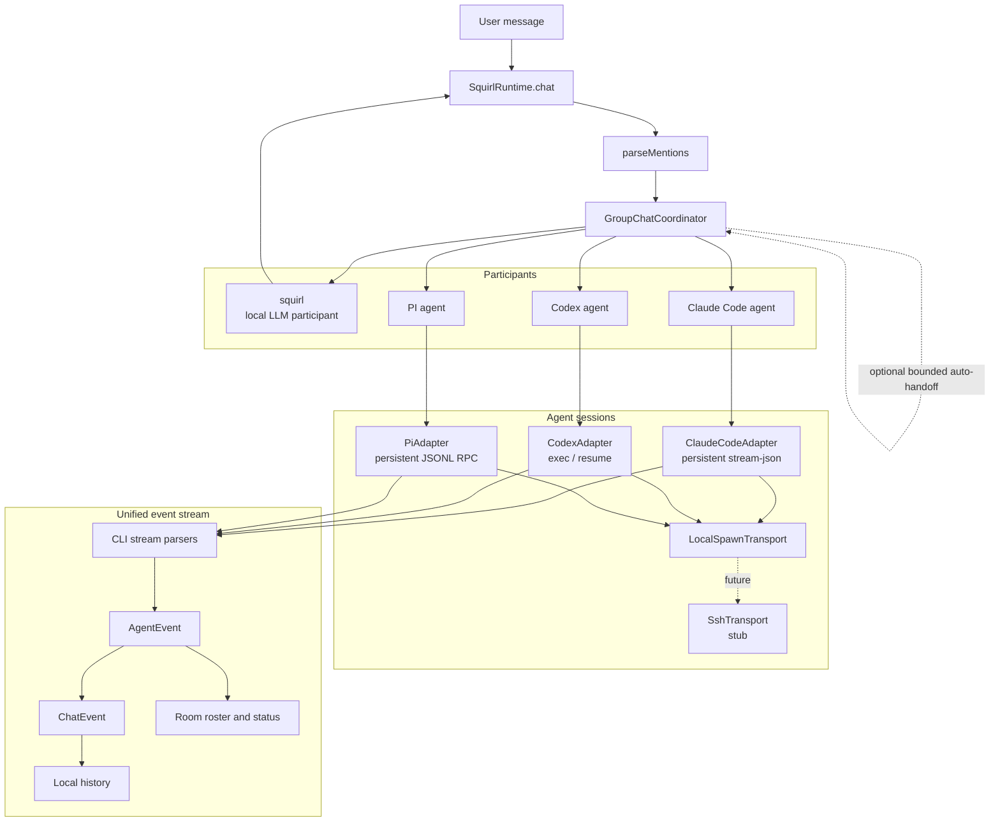

# Multi-Agent Room Architecture

## Completion Signals

| Slice | Status | Completion | Notes |
|---|---:|---:|---|
| Participant model | In place | 85% | User, local LLM, and external agents share a routing model. |
| Claude/Codex/PI adapters | In place | 80% | PI uses a persistent RPC process and settles turns only after retries/compaction and a usage readback. |
| Safety defaults | In place | 80% | Auto-handoff is off by default. PI defaults to full coding tools by product choice and is explicitly labeled unsandboxed; read-only mode is available. |
| UI room roster | In place | 75% | TUI and web surfaces expose participants and status. |
| Async broadcast | In place | 85% | Participant turns use independent FIFOs and web/Electron receives background events from `GET /api/events`. |
| SSH transport | Stub | 10% | Interface exists but remote execution is not implemented. |

## Known Gaps

- Event reconnects reconcile from authoritative application state; the event feed does not durably replay every transient token.
- Queued outbox work is runtime-local and is intentionally discarded rather than replayed after restart.
- SSH-backed agents are represented by a transport stub, not a working remote path.
- PI is an external prerequisite. Squirl neither installs PI nor stores its provider credentials.
- PI has no native permission prompt or sandbox. Its `coding` tool mode can run shell commands and edit files; `read-only` restricts built-ins to `read`, `grep`, `find`, and `ls`.

## PI RPC integration

Squirl launches `pi --mode rpc` without automatically approving project trust. Text, tool activity, extension dialogs, session identity, interruption, and context statistics are translated into the shared agent contracts. Interactive extension requests (`select`, `confirm`, `input`, and `editor`) are bridged into the active Squirl frontend; notifications, transient status, and editor prefill are also forwarded. Unsupported cosmetic extension widgets, themes, and titles are ignored without blocking the agent.

Protocol references: [PI CLI](https://github.com/earendil-works/pi/blob/main/packages/coding-agent/README.md) and [PI RPC mode](https://github.com/earendil-works/pi/blob/main/packages/coding-agent/docs/rpc.md).
