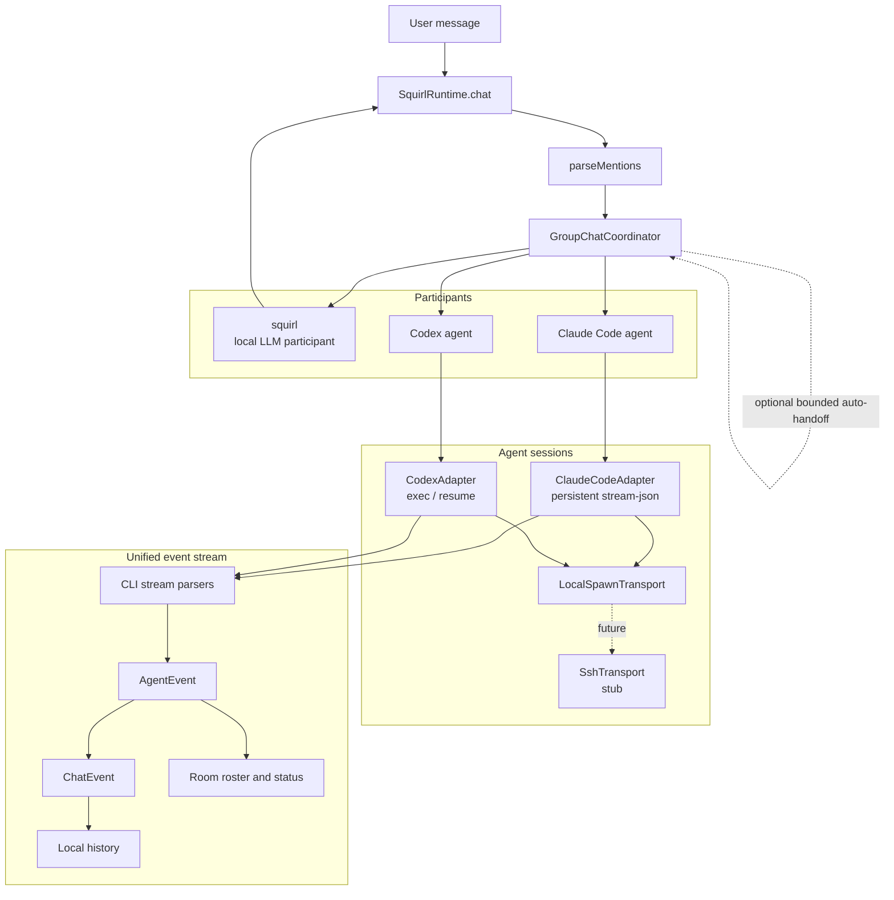

# Multi-Agent Room Architecture

## Completion Signals

| Slice | Status | Completion | Notes |
|---|---:|---:|---|
| Participant model | In place | 85% | User, local LLM, and external agents share a routing model. |
| Claude/Codex adapters | In place | 70% | Codex live path has been validated; Claude uses captured fixtures and tests plus adapter implementation. |
| Safety defaults | In place | 80% | Auto-handoff off by default, hop limit, conservative CLI permission defaults. |
| UI room roster | In place | 75% | TUI and web surfaces expose participants and status. |
| Async broadcast | Gap | 35% | Web uses the existing per-request stream; no persistent event broadcast yet. |
| SSH transport | Stub | 10% | Interface exists but remote execution is not implemented. |

## Known Gaps

- A second web tab does not receive turns from another tab.
- Truly async/background agent output needs a persistent event channel such as `GET /api/events`.
- SSH-backed agents are represented by a transport stub, not a working remote path.
