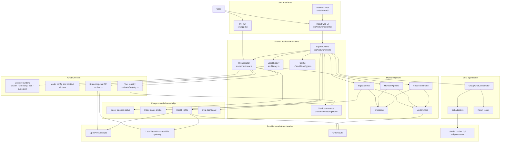

# Overall Architecture

## Source Owners

| Area | Primary source |
|---|---|
| TUI chat surface | `src/app.tsx`, `src/components/*` |
| Web/Electron runtime | `src/web/runtime.ts`, `src/web/renderer.tsx`, `src/electron/*` |
| Chat orchestration | `src/orchestrator.ts`, `src/api.ts` |
| Context assembly | `src/context/*` |
| Tools | `src/tools/*`, `src/commands/registry.ts` |
| Memory and indexing | `src/search/*` |
| Eval dashboard | `src/search/eval/*`, `src/web/EvalDashboard.tsx` |
| Multi-agent room | `src/agents/*` |
| Health lights | `src/web/health.ts` |

## Current Reading

The architecture is a shared runtime with multiple frontends. The TUI talks directly to the orchestrator, while the web and Electron surfaces use `SquirlRuntime` as the stateful bridge for config, history, health, evals, agents, and streaming chat events.
