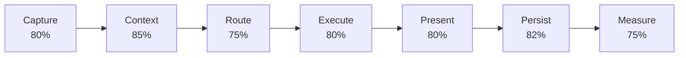
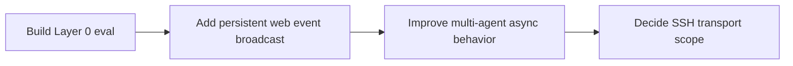

# Pipeline Status Tracker

This is the detailed companion to [[README|Squirl Linear Pipeline]]. Percentages combine implemented behavior, test coverage, and day-to-day usability.

## Pipeline Rollup

## Stage Tracker

| Stage                   | Completion | State              | Current truth                                                                                         | Next action                                                                            |
| ----------------------- | ---------: | ------------------ | ----------------------------------------------------------------------------------------------------- | -------------------------------------------------------------------------------------- |
| 1. Capture request      |        80% | Usable             | The TUI, web UI, and Electron shell can start a chat through shared configuration and model state.    | Harden the web/Electron path through continued real use.                               |
| 2. Assemble context     |        85% | Stable             | Conversation history, selected files, truncation, and recalled memory are assembled before execution. | Expand retrieval quality coverage before changing ranking behavior.                    |
| 3. Route the work       |        75% | Usable with limits | Hosted and local models, built-in tools, and `@mention` participants can be selected or invoked.      | Decide the remote-agent transport scope and polish new-backend discovery.              |
| 4. Execute the turn     |        80% | Usable             | Streaming chat, tool calls, approvals, and CLI-backed agent sessions work.                            | Improve asynchronous multi-agent behavior and revisit permissions as tool scope grows. |
| 5. Present the response |        80% | Usable             | Streaming output, status, errors, room state, and dependency health are visible in the interfaces.    | Add persistent event broadcast for background agents and multiple web clients.         |
| 6. Save and learn       |        82% | Stable             | JSONL history, rewind cleanup, turn-pair indexing, imports, and backfills are implemented.            | Improve visibility into stale or failed indexing.                                      |
| 7. Verify and improve   |        75% | Usable             | Health probes, eval Layers 1-3, frozen/live runs, comparisons, dashboard, and monitor history exist.  | Build Layer 0 for query-extraction quality.                                            |

## Near-Term Sequence

## Update Checklist

- Update this tracker when a stage crosses a meaningful threshold: first usable, tested, shipped, or intentionally deferred.
- Keep stage names stable so progress can be scanned over time.
- Link new architecture notes from [[README]].
