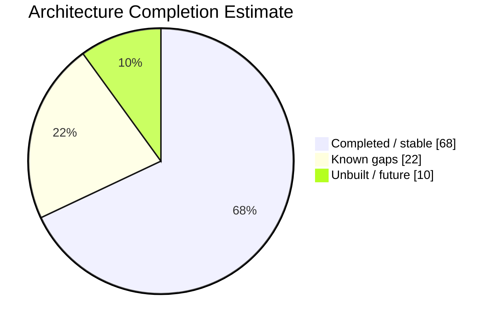
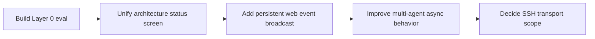

# Architecture Status Tracker

Percentages are working estimates for architecture completion. They combine implemented behavior, test coverage, UX completeness, and known gaps.

## Rollup

## Component Tracker

| Component | Completion | State | Current truth | Next step |
|---|---:|---|---|---|
| Core chat orchestration | 90% | Stable | Context assembly, truncation, streaming, tools, memory injection, and status callbacks are implemented. | Add prompt/tool inspection only when debugging workflows need it. |
| TUI experience | 85% | Stable | Ink chat, status bar, model picker, context picker, rewind, room roster, and scrolling behavior exist. | Continue small UX hardening from real use. |
| Web/Electron shared runtime | 75% | Usable | React/Vite web UI and Electron shell share `SquirlRuntime`, history, config, model state, health, evals, and agents. | Add persistent event broadcast before relying on multi-tab or background agent output. |
| Provider routing | 80% | Usable | Hosted and local OpenAI-compatible paths exist; local gateway fallback behavior is in place. | Keep model discovery/context-window persistence polished as new backends appear. |
| Memory indexing | 85% | Usable | Turn-pair ingestion, chunking, embeddings, vector store writes, and import/backfill paths exist. | Improve operational visibility around stale or failed indexing. |
| Memory retrieval | 80% | Usable | Meta query extraction, embedding, vector search, ranking, prompt injection, and inline display exist. | Expand quality evals before changing ranking behavior. |
| Eval harness | 80% | Usable | Layers 1-3, frozen/live modes, compare, dashboard, and monitor history exist. | Build Layer 0 for query-extraction quality. |
| Health lights | 70% | Usable | Model, embedder, vector DB, and meta model probes are config-derived and shown in the web UI. | Tie health into a broader architecture/progress dashboard. |
| Multi-agent room | 65% | Usable with limits | Coordinator, participants, adapters, parsers, CLI subprocess transport, roster, and safe handoff defaults exist. | Add persistent event broadcast and decide whether SSH transport is in scope. |
| Tools and approvals | 70% | Usable | File, command, and directory tools exist; network command approval is guarded. | Revisit permissions if tool scope expands beyond local developer workflows. |
| Rewind/history | 80% | Usable | Local JSONL history, imported-history boundaries, rewind, and vector cleanup exist. | Add more visual history management if rewind becomes a frequent workflow. |

## Near-Term Sequence

## Update Checklist

- Update this tracker when a component crosses a meaningful threshold: first usable, tested, shipped, or intentionally deferred.
- Keep component names stable so progress can be scanned over time.
- Link new architecture notes from [[README]].

